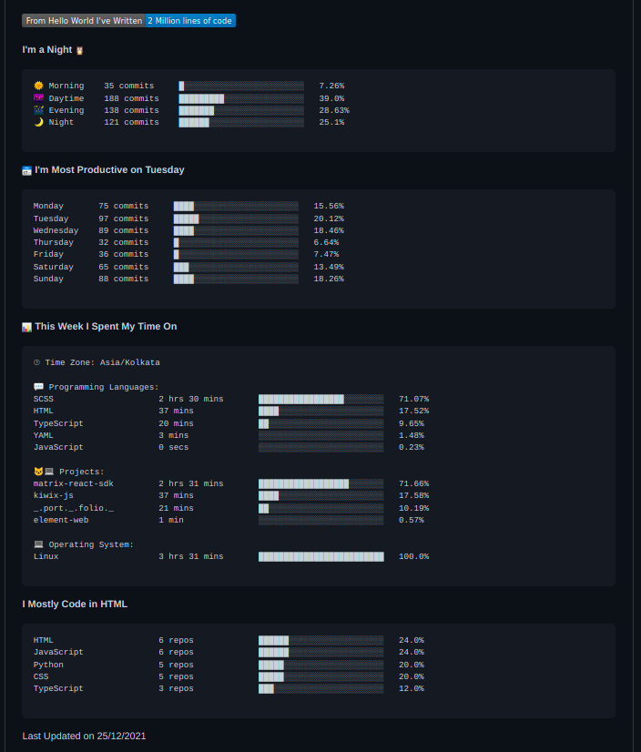

Your profile page tells people the story of your work through the repositories you're interested in, the contributions you've made, and the conversations you've had. So, you should put an effort into making your profile stand out.

One way to do this is to show your visitors nerdy stats like how much coding you've been doing, what languages you have been working on and how productive you've been for the past few days. You can take a look at the screenshot of my Github profile, amazing isn't it.

<iframe src="https://giphy.com/embed/62PP2yEIAZF6g" width="400" height="250" class="giphy-embed"></iframe>

### Prerequisites:

* A Github account
    
* A Github profile README (don't have one, follow [docs](https://docs.github.com/en/account-and-profile/setting-up-and-managing-your-github-profile/customizing-your-profile/managing-your-profile-readme) to create one)
    
* A WakaTime account (set it up [here](https://wakatime.com/welcome) )
    

### Steps:

* To start with, edit your `README.md` of your Github profile, your repo will be `username/username` and insert:
    

```plaintext
<!--START_SECTION:waka-->
<!--END_SECTION:waka-->
```

wherever you want your code stats to appear.

* Next step is to get your WakaTime API Key from your "Account Settings" in [WakaTime](https://wakatime.com/welcome), as shown below:
    
    
    
* Next, you'll need to install the WakaTime plugin for your favourite IDE. Look into [this](https://wakatime.com/plugins) page to get information about various plugins for different IDEs. In my case, I prefer VS Code so I installed its VS Code plugin. To set up WakaTime with VS Code visit: https://wakatime.com/vs-code
    
* Now, head back to your Github repo, go to the "Settings" tab and then "Secrets". Create a new **Actions Secret** (not an environment one). The name of this secret must be `WAKATIME_API_KEY` and the value should be the API key obtained in the previous step.
    
    
    
* Next, create a GitHub workflow with name and directory as specified: `.github/workflows/waka.yml`. And paste the following code in the newly created workflow:
    

```plaintext
name: Waka Readme

on:
  schedule:
    # Runs every 4 hours
    - cron: '0 */4 * * *'
  workflow_dispatch:

jobs:
  update-readme:
    name: Update Readme with Metrics
    runs-on: ubuntu-latest
    steps:
      - uses: anmol098/waka-readme-stats@master
        with:
          WAKATIME_API_KEY: ${{ secrets.WAKATIME_API_KEY }}
          SHOW_OS: "True"
          SHOW_PROJECTS: "True"
          SHOW_PROFILE_VIEWS: "False"
          SHOW_EDITORS: "False"
          SHOW_LANGUAGE_PER_REPO: "True"
          SHOW_LOC_CHART: "False"
          SHOW_LINES_OF_CODE: "True"
          SHOW_SHORT_INFO: "False"
```

The job runs every 4 hours, in order to make some adjustments, visit: https://crontab.guru.

**Note**: It takes time for your stats to appear, you need to log enough time in WakaTime, and give it enough data to actually report.

### Conclusion:

Thank you for reading, hope you enjoyed the article! Queries and feedback are most welcome :) kindly leave them below.

Follow me on [Twitter](https://twitter.com/ankurrap) | [LinkedIn](https://www.linkedin.com/in/ankur-patil-a112a3202/) for more web development-related tips and posts.

That's all for today! You have read the article till the end.

<iframe src="https://giphy.com/embed/1xucXbDnMIYkU" width="400" height="250" class="giphy-embed"></iframe>